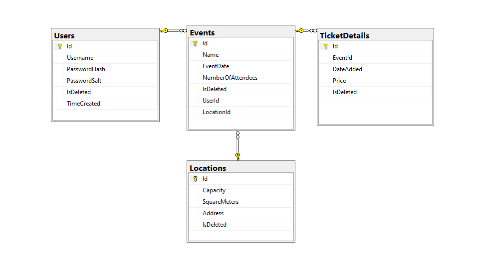

# Eventify

### Tech stack
- .NET Core 3.1
- EF Core
- JWT
- MS SQL

### Specifics
- Web API 2.0
- Model-Controller with DTO
- ORM via EF (Models) and AutoMapper (DTOs)
- Asynchronous
- Repository pattern for auth
- Service pattern for every other table
- Custom users (Not Identity)

## Basic schema of endpoints

#### Auth
- **_[POST]_ /auth/login** - logs user in and returns token as header
- **_[POST]_ /auth/register** - registers user
- **_[DELETE]_ /auth?id=0000** - deletes user

#### All other tables
- **_[GET]_ /*\(entity)*/** - returns all entities
- **_[GET]_ /*\(entity)*?id=0000** - searches for entity by id and returns it/null
- **_[POST]_ /*\(entity>)*** - Creates record for that entity. Takes request body
- **_[PUT]_ /*\(entity)>*** - Updates record for that entity. Takes request body
- **_[DELETE]_ /*\(entity)*?id=0000** - Deletes entity

### Access
- A user can get all entities
- A user can add entities of any type
- A user can only edit & delete their own events
- A user cannot delete other users
- A user can edit and delete all locations and ticket details regardless of creator

### Database structure

